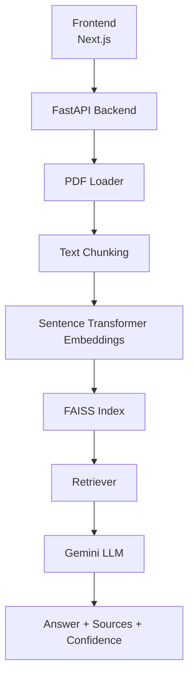

# DocuTrust AI – Enterprise Document Assistant

<p align="center">
  
</p>

<p align="center">
  
  
  
  
  
  
  
</p>

<p align="center">
  A modern full-stack Retrieval-Augmented Generation platform for PDF question answering, built for enterprise-style document intelligence, confidence scoring, and source-grounded responses.
</p>

---

##  Project Description

DocuTrust AI is a full-stack AI-powered document assistant that lets users upload PDF files, ask natural language questions, and receive answers grounded in the uploaded content. The system uses Retrieval-Augmented Generation (RAG) to extract document text, split it into meaningful chunks, generate embeddings, search with FAISS, and generate responses with Google Gemini.

The project is designed as a portfolio-ready enterprise application with a polished user experience, analytics, logging, and a clean API-driven architecture.

<details>
<summary>Why this project stands out</summary>

- Built around a real RAG pipeline instead of a single prompt-response loop.
- Returns confidence-aware answers with source references.
- Includes upload analytics, chat history, dashboard stats, and live activity tracking.
- Uses a modern Next.js frontend and a FastAPI backend with MongoDB persistence.

</details>

---

##  Features

| Feature                              | Description                                             |
| ------------------------------------ | ------------------------------------------------------- |
| PDF Upload                           | Upload and process PDF documents from the UI            |
| AI Question Answering                | Ask natural language questions about uploaded documents |
| Retrieval-Augmented Generation (RAG) | Grounded answering based on retrieved context           |
| FAISS Vector Search                  | Fast similarity search across document embeddings       |
| Google Gemini Integration            | Generates contextual and fluent answers                 |
| Confidence Score                     | Shows how strong the retrieval and answer signal is     |
| Source Citations with Page Numbers   | Supports traceability back to document pages            |
| Query Rewriting                      | Improves retrieval by refining the user query           |
| Chat History                         | Stores past conversations for later review              |
| Dashboard Statistics                 | Summarizes document and activity metrics                |
| Live Agent Activity                  | Displays what the backend pipeline is doing             |
| MongoDB Logging                      | Tracks upload, retrieval, and chat events               |
| Responsive Modern UI                 | Optimized for desktop and mobile use                    |

---

##  Architecture Diagram



<details>
<summary>Pipeline summary</summary>

The frontend sends uploads and chat requests to the backend. The backend extracts PDF text, chunks it, creates embeddings, builds a FAISS index, retrieves the most relevant content, and sends that context to Gemini to produce a grounded answer.

</details>

---

##  Tech Stack

### Frontend

| Technology   | Purpose               |
| ------------ | --------------------- |
| Next.js 16   | App framework         |
| React 19     | UI rendering          |
| TypeScript   | Type-safe development |
| Tailwind CSS | Styling system        |
| Axios        | API requests          |
| Lucide React | Icons                 |

### Backend

| Technology               | Purpose                  |
| ------------------------ | ------------------------ |
| FastAPI                  | API server               |
| Python                   | Core backend language    |
| FAISS                    | Vector similarity search |
| Sentence Transformers    | Embedding generation     |
| Google Gemini API        | Answer generation        |
| PyMuPDF                  | PDF text extraction      |
| LangChain Text Splitters | Chunking logic           |
| MongoDB                  | Logging and persistence  |
| PyMongo                  | MongoDB driver           |

### AI

| Technology                           | Purpose                    |
| ------------------------------------ | -------------------------- |
| Retrieval-Augmented Generation (RAG) | Grounded QA workflow       |
| Sentence Transformer Embeddings      | Semantic representation    |
| Semantic Search                      | Similarity-based retrieval |
| Query Rewriting                      | Better retrieval quality   |
| Confidence Scoring                   | Answer quality estimation  |

### Database

| Technology    | Purpose               |
| ------------- | --------------------- |
| MongoDB Atlas | Cloud-hosted database |

---

##  Folder Structure

```text
DocuTrust/
├── frontend/
│   ├── app/
│   │   ├── globals.css
│   │   ├── layout.tsx
│   │   └── page.tsx
│   ├── components/
│   │   ├── AgentActivity.tsx
│   │   ├── AnswerCard.tsx
│   │   ├── ChatBox.tsx
│   │   ├── ChatHistory.tsx
│   │   ├── DashboardStats.tsx
│   │   ├── DocumentInfo.tsx
│   │   ├── Navbar.tsx
│   │   └── UploadBox.tsx
│   ├── public/
│   ├── package.json
│   ├── next.config.ts
│   └── tsconfig.json
│
└── backend/
    ├── main.py
    ├── list_models.py
    ├── requirements.txt
    ├── database/
    │   └── mongo.py
    ├── rag/
    │   ├── chunker.py
    │   ├── crag.py
    │   ├── embeddings.py
    │   ├── generator.py
    │   ├── loader.py
    │   ├── query_rewrite.py
    │   ├── reranker.py
    │   ├── retriever.py
    │   ├── router.py
    │   ├── web_fallback.py
    │   ├── web_generator.py
    │   └── web_search.py
    ├── routes/
    │   ├── chat.py
    │   ├── dashboard.py
    │   ├── documents.py
    │   ├── history.py
    │   ├── logs.py
    │   └── upload.py
    ├── storage/
    │   └── faiss.index
    └── uploads/
```

---

##  Installation

<details open>
<summary>Backend Setup</summary>

### 1. Clone the repository

```bash
git clone https://github.com/your-username/DocuTrust.git
cd DocuTrust
```

### 2. Create a virtual environment

```bash
cd backend
python -m venv .venv
```

### 3. Activate the virtual environment

Windows:

```bash
.venv\\Scripts\\activate
```

macOS / Linux:

```bash
source .venv/bin/activate
```

### 4. Install backend dependencies

```bash
pip install -r requirements.txt
```

### 5. Create the environment file

Create a `.env` file inside the `backend` folder.

### 6. Add backend environment variables

```env
GOOGLE_API_KEY=your_google_gemini_api_key
MONGODB_URI=your_mongodb_connection_string
```

### 7. Run the FastAPI server

```bash
uvicorn main:app --reload
```

The backend runs at `http://127.0.0.1:8000`.

</details>

<details>
<summary>Frontend Setup</summary>

### 1. Move to the frontend directory

```bash
cd ../frontend
```

### 2. Install dependencies

```bash
npm install
```

### 3. Add frontend environment variables

Create a `.env.local` file inside the `frontend` folder.

```env
NEXT_PUBLIC_API_URL=http://127.0.0.1:8000
```

### 4. Run the Next.js app

```bash
npm run dev
```

The frontend runs at `http://localhost:3000`.

</details>

---

##  Environment Variables

| Scope    | Variable              | Description                     |
| -------- | --------------------- | ------------------------------- |
| Backend  | `GOOGLE_API_KEY`      | Google Gemini API key           |
| Backend  | `MONGODB_URI`         | MongoDB Atlas connection string |
| Frontend | `NEXT_PUBLIC_API_URL` | FastAPI backend URL             |

---

##  Screenshots

<details>
<summary>Screenshot placeholders</summary>

### Home Page


### Upload Section


### Dashboard


### AI Answer


### Chat History


### Agent Activity


### Document Information


</details>

---

## 🔌 API Endpoints

| Method | Endpoint     | Description                                                                               |
| ------ | ------------ | ----------------------------------------------------------------------------------------- |
| POST   | `/upload`    | Upload a PDF, extract text, create chunks, generate embeddings, and build the FAISS index |
| POST   | `/chat`      | Ask a question and receive a generated answer with confidence and sources                 |
| GET    | `/history`   | Return saved conversation history from MongoDB                                            |
| GET    | `/dashboard` | Return summary statistics for the dashboard                                               |
| GET    | `/documents` | Return uploaded document metadata                                                         |
| GET    | `/logs`      | Return backend event logs                                                                 |

### Endpoint Details

#### POST /upload

Uploads a PDF, extracts text with PyMuPDF, splits the content into chunks, generates embeddings with Sentence Transformers, and builds the FAISS index.

#### POST /chat

Accepts a natural language question, resolves the best retrieval path, fetches relevant chunks, and generates a grounded response using Gemini.

#### GET /history

Returns prior question-and-answer records so users can revisit conversations.

#### GET /dashboard

Provides a high-level summary of project activity and document usage.

#### GET /documents

Returns uploaded document metadata such as filename, chunk count, and upload timestamp.

#### GET /logs

Returns internal logs for uploads, retrieval, indexing, and answer generation.

---

##  Working Pipeline

1. Upload PDF
2. Extract Text
3. Split into Chunks
4. Generate Embeddings
5. Build FAISS Index
6. Rewrite Query
7. Retrieve Relevant Chunks
8. Validate Retrieval
9. Generate Answer using Gemini
10. Display Confidence Score
11. Display Source Citations
12. Store Logs

### Pipeline Explanation

The workflow begins when a user uploads a PDF. The backend extracts the document text, splits it into structured chunks, and generates embeddings for semantic search. Those embeddings are stored in a FAISS index for fast retrieval.

When a question arrives, the system can rewrite it for better matching, retrieve the most relevant chunks, optionally rerank them, and then pass the grounded context to Gemini. The final response includes a confidence score, source citations, and logs for observability.

---

##  Future Improvements

- Multi-document support
- OCR for scanned PDFs
- Hybrid Search (BM25 + FAISS)
- Streaming Responses
- Authentication
- Conversation Memory
- Better Hallucination Detection
- Docker Support
- Cloud Deployment

---

##  Deployment

| Layer    | Platform      |
| -------- | ------------- |
| Frontend | Vercel        |
| Backend  | Render        |
| Database | MongoDB Atlas |

---

##  Contributing

Contributions are welcome. To contribute:

1. Fork the repository
2. Create a feature branch
3. Commit your changes
4. Open a pull request

Please keep contributions focused, documented, and aligned with the current architecture.

---

##  License

This project is intended for educational and portfolio use. Add your preferred license here if you plan to publish the repository publicly.

---

##  Author

**Abhay Rajput**

GitHub: Add placeholder  
LinkedIn: Add placeholder

---

##  Acknowledgements

Special thanks to the tools and libraries that power this project:

- Google Gemini
- Sentence Transformers
- FastAPI
- Next.js
- MongoDB
- FAISS
- LangChain

---

<details>
<summary>Quick start</summary>

```bash
# Backend
cd backend
python -m venv .venv
.venv\\Scripts\\activate
pip install -r requirements.txt
uvicorn main:app --reload

# Frontend
cd ../frontend
npm install
npm run dev
```

</details>
